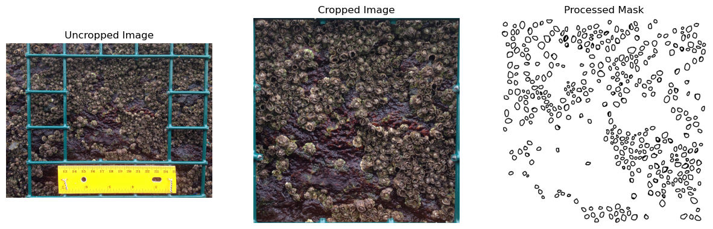
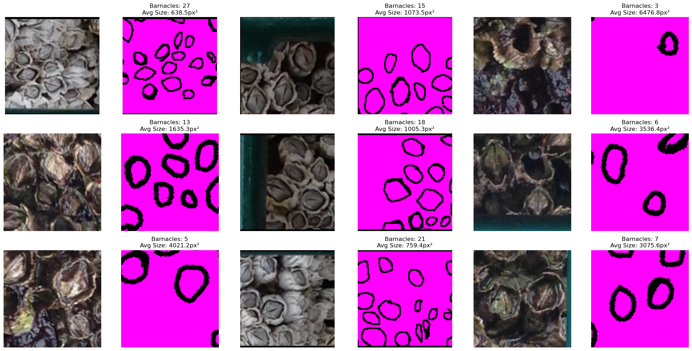
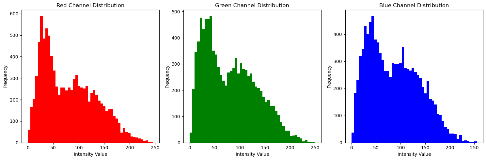
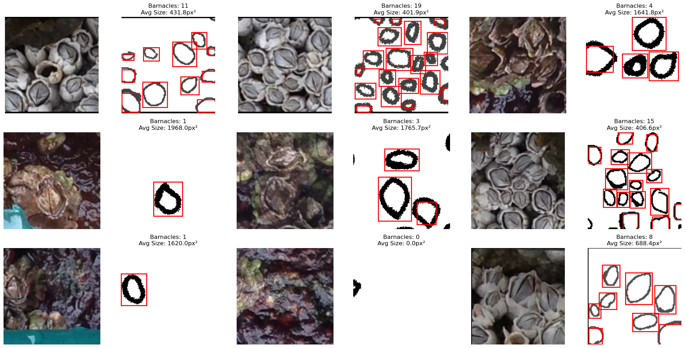

# National Park Service - Barnacles  
## DALI Challenge  
### Author: Arnav Singh  

## Overview  

This repository contains the code and documentation for a prototype system designed to assist National Park Service scientists in efficiently counting barnacles in images. By automating this process, the aim is to reduce the time and effort required for laborious manual counting, enabling scientists to focus on higher-level research tasks.  

The project explores a comprehensive approach that includes data preprocessing, exploratory data analysis (EDA), basic Convolutional Neural Networks (CNNs), and state-of-the-art Vision Transformers (ViTs) for semantic segmentation. Through experimentation and evaluation, the project demonstrates potential solutions while addressing challenges such as small datasets and the contouring of Barnacles.  

---

## Repository Structure  

```plaintext
barnacle-counting-challenge/
├── README.md                   # Project documentation (this file)
├── barnacle.ipynb              # Jupyter Notebook documenting the process and results
├── requirements.txt            # Python dependencies
├── Barnacles/                  # Provided dataset
│   ├── img1.png
│   ├── img2.png
│   ├── mask1.png
│   ├── mask2.png
│   └── unseen_img1.png
└── barnacle_py/                # Custom Python utilities
    └── utils.py
```  
> [!NOTE]
> Data Processing adds directories `processed`, `test`, `train`, and `val` to the project structure on your local machine.

---

## Approach  

### Steps in the Solution  

1. **Data Loading & Preprocessing**:  
   - Images and masks were resized, normalized, and segmented into smaller grid-based patches for more effective training. 
    
   - Rotations were applied to artificially expand the dataset size, given the limited number of images.  

2. **Exploratory Data Analysis (EDA)**:  
   - Explored dataset characteristics, such as barnacle coverage, resolution, and morphological traits.
     
   
   - Visualized random image-mask pairs to verify preprocessing quality.  
   - Identified contours via rectangle
   

3. **Modeling**:  
   - **Baseline Model**: Implemented a CNN (based on Unet) for binary segmentation. Achieved reasonable performance and set the stage for more advanced approaches.
  

   - **Vision Transformer (ViT)**: Built a ViT-based model inspired by recent research in segmentation tasks. While it demonstrated promise, it was computationally intensive and underperformed due to dataset size limitations. Would probably need access to an HPC to run it efficiently (perhaps even discovery) 

4. **Results and Analysis**:  
   - Evaluated the models on the task of barnacle segmentation and counting.  
   - Explored the trade-offs between model complexity, performance, and computational requirements.  

5. **Counting and Contour Detection**:  
   - Post-processed model predictions to count barnacles using contour detection algorithms in OpenCV.  

6. **Conclusions and Next Steps**:  
   - Summarized insights gained from the project and proposed directions for improving the system.  

---

## How to Run the Code  

### Prerequisites  

1. **Install Dependencies**: Install the required libraries using `requirements.txt`:
   ```bash
   pip install -r requirements.txt
   ```  

2. **Prepare the Dataset**:  
   Place the provided images and masks in the `Barnacles/` directory. Ensure the directory structure matches the repository layout.  

3. **Run the Notebook**:  
   Open `barnacle.ipynb` in Jupyter Notebook or a similar environment. Run the cells sequentially to replicate the results.  

---

## Results  

- **Baseline CNN**: Achieved a validation loss of approximately 0.2146, demonstrating its ability to perform barnacle segmentation with reasonable accuracy.  
- **Vision Transformer**: Despite its advanced architecture, the ViT struggled to generalize effectively due to the small dataset and achieved higher validation loss compared to the CNN.  
- **Counting Accuracy**: Contour-based methods successfully counted barnacles in the model predictions, though further refinement is needed to improve precision.  

---

## Learning and Next Steps  

For me personally, this project provided hands-on experience in computer vision and deep learning for real-world ecological applications, even if its just barnacles. I developed a familiarity with OpenCV for preprocessing and contour detection. I began to understanding CNNs and Vision Transformers for semantic segmentation tasks. Finally, I overcame the challenges of limited datasets through augmentation techniques like rotations and grid-based cropping.  

**Next Steps**:  
For the future, I would hope to expand the dataset with more diverse images to improve model (no bimodality). Explore hyperparameter tuning and pretrained segmentation-specific ViTs for better performance (GridSearchCV). Refine the contour detection algorithms for more precise barnacle counting, and develop a user-friendly interface (using the suggested Streamlit) to deploy the system for field use by scientists.  

---

## Dependencies  

Key Python libraries required for the project include:  
- `torch`, `torchvision`  
- `opencv-python`  
- `matplotlib`  
- `numpy`  
- `pandas`  
- `tqdm`  
- `einops` (for Vision Transformers)  

Install all dependencies using:  
```bash
pip install -r requirements.txt
```  

---

## Contact  

**Author**: Arnav Singh  
**Email**: arnav.singh.26@dartmouth.edu  
**GitHub**: [arnavsingh0](https://github.com/arnavsingh0)  

This project was completed as part of the DALI Lab data challenge, showcasing my ability to explore open-ended problems and implement practical solutions. I appreciate everyone who is reading this, thank you!